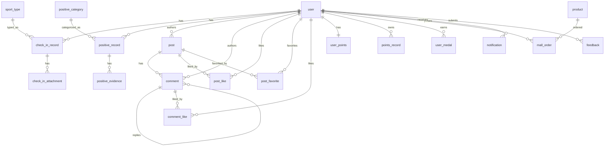

# EPlugger 数据库结构文档

## 1. 基础信息

- 数据库：`eplugger`（MySQL）
- 字符集：`utf8mb4`（迁移脚本中大部分表使用 `utf8mb4_unicode_ci`）
- 迁移工具：Flyway（`spring.flyway.enabled=true`）
- JPA 策略：`ddl-auto: validate`（以数据库既有结构为准，不自动建表）

## 2. 业务域拆分

- 用户与认证：`user`
- 运动打卡：`sport_type`、`check_in_record`、`check_in_attachment`
- 正向打卡：`positive_category`、`positive_record`、`positive_evidence`
- 圈子社交：`topic`、`post`、`post_like`、`post_favorite`、`comment`、`comment_like`、`user_follow`
- 积分与商城：`user_points`、`points_record`、`user_medal`、`product`、`mall_order`
- 通知与反馈：`notification`、`feedback`

## 3. ER 关系（核心）

## 4. 全表概览

| 业务域 | 中文名 | 表名 | 主键 |
|---|---|---|---|
| 用户与认证 | 用户 | `user` | `id` |
| 运动打卡 | 运动类型 | `sport_type` | `id` |
| 运动打卡 | 运动打卡记录 | `check_in_record` | `id` |
| 运动打卡 | 运动打卡附件 | `check_in_attachment` | `id` |
| 正向打卡 | 正向分类 | `positive_category` | `id` |
| 正向打卡 | 正向记录 | `positive_record` | `id` |
| 正向打卡 | 正向佐证 | `positive_evidence` | `id` |
| 圈子社交 | 话题 | `topic` | `id` |
| 圈子社交 | 动态 | `post` | `id` |
| 圈子社交 | 动态点赞 | `post_like` | `id` |
| 圈子社交 | 动态收藏 | `post_favorite` | `id` |
| 圈子社交 | 评论 | `comment` | `id` |
| 圈子社交 | 评论点赞 | `comment_like` | `id` |
| 圈子社交 | 关注关系 | `user_follow` | `id` |
| 积分与商城 | 用户积分汇总 | `user_points` | `user_id` |
| 积分与商城 | 积分流水 | `points_record` | `id` |
| 积分与商城 | 用户勋章 | `user_medal` | `id` |
| 积分与商城 | 商品 | `product` | `id` |
| 积分与商城 | 兑换订单 | `mall_order` | `id` |
| 通知与反馈 | 通知 | `notification` | `id` |
| 通知与反馈 | 反馈 | `feedback` | `id` |

## 5. 表结构明细

> 说明：以下以 **JPA 实体 + Flyway 迁移** 合并后的当前结构为准。  
> `PK`=主键，`FK`=外键，`UQ`=唯一约束，`IDX`=普通索引。

### 5.1 用户（`user`）

| 字段 | 类型 | 约束 | 说明 |
|---|---|---|---|
| `id` | BIGINT | PK, AUTO_INCREMENT | 用户 ID |
| `phone` | VARCHAR(20) | NOT NULL, UQ | 手机号 |
| `name` | VARCHAR(100) | NOT NULL | 姓名 |
| `avatar` | VARCHAR(512) | NULL | 头像 |
| `department` | VARCHAR(100) | NULL | 部门 |
| `position` | VARCHAR(100) | NULL | 岗位 |
| `password_hash` | VARCHAR(255) | NULL | 密码哈希 |
| `sso_id` | VARCHAR(255) | NULL | SSO 标识 |
| `created_at` | DATETIME(6) | NOT NULL | 创建时间 |

索引：
- `UQ(phone)`
- `IDX idx_user_sso_id (sso_id(100))`

### 5.1a epWorkApp SSO — `epwork_sso_nonce`

| 字段 | 类型 | 约束 | 说明 |
|---|---|---|---|
| `nonce` | VARCHAR(128) | PK | 外链 token 中的 nonce，插入成功即视为已消费 |
| `consumed_at` | DATETIME(6) | NOT NULL | 消费时间 |

### 5.1b epWorkApp SSO — `epwork_sso_exchange_code`

| 字段 | 类型 | 约束 | 说明 |
|---|---|---|---|
| `code` | VARCHAR(64) | PK | 短时一次性交换码 |
| `user_id` | BIGINT | FK → `user.id`, NOT NULL | 待签发 JWT 的用户 |
| `created_at` | DATETIME(6) | NOT NULL | 创建时间 |
| `expires_at` | DATETIME(6) | NOT NULL | 过期时间 |
| `used` | TINYINT(1) | NOT NULL | 是否已兑换 |

索引：`IDX idx_sso_exchange_expires (expires_at)`

---

### 5.2 运动类型（`sport_type`）

| 字段 | 类型 | 约束 | 说明 |
|---|---|---|---|
| `id` | VARCHAR(50) | PK | 运动类型 ID（如 `running`） |
| `name` | VARCHAR(100) | NOT NULL | 名称 |
| `icon` | VARCHAR(50) | NOT NULL | 图标 |
| `sort_order` | INT | NOT NULL | 排序 |
| `is_enabled` | TINYINT(1) | NOT NULL | 是否启用 |
| `created_at` | DATETIME(6) | NOT NULL | 创建时间 |

索引：
- `IDX idx_sport_type_sort (sort_order)`

### 5.3 运动打卡记录（`check_in_record`）

| 字段 | 类型 | 约束 | 说明 |
|---|---|---|---|
| `id` | BIGINT | PK, AUTO_INCREMENT | 记录 ID |
| `user_id` | BIGINT | FK, NOT NULL | 用户 ID |
| `sport_type_id` | VARCHAR(50) | FK, NOT NULL | 运动类型 ID |
| `duration` | INT | NOT NULL | 时长 |
| `duration_unit` | VARCHAR(20) | NOT NULL | `minute`/`hour` |
| `distance` | DECIMAL(12,2) | NULL | 距离 |
| `distance_unit` | VARCHAR(10) | NULL | `km`/`m` |
| `intensity` | VARCHAR(20) | NOT NULL | `low`/`medium`/`high` |
| `points` | INT | NOT NULL | 获得积分 |
| `status` | VARCHAR(30) | NOT NULL | `normal`/`suspicious`/`pending_review`/`rejected` |
| `checked_in_at` | DATETIME(6) | NOT NULL | 打卡时间 |
| `created_at` | DATETIME(6) | NOT NULL | 创建时间 |

索引：
- `IDX idx_checkin_user_checked (user_id, checked_in_at)`
- `IDX idx_checkin_sport (sport_type_id)`

### 5.4 运动打卡附件（`check_in_attachment`）

| 字段 | 类型 | 约束 | 说明 |
|---|---|---|---|
| `id` | BIGINT | PK, AUTO_INCREMENT | 附件 ID |
| `check_in_record_id` | BIGINT | FK, NOT NULL | 所属打卡记录 |
| `url` | VARCHAR(512) | NOT NULL | 文件 URL |
| `type` | VARCHAR(20) | NOT NULL | `image`/`screenshot` |
| `uploaded_at` | DATETIME(6) | NOT NULL | 上传时间 |

索引：
- `IDX idx_attachment_record (check_in_record_id)`

---

### 5.5 正向分类（`positive_category`）

| 字段 | 类型 | 约束 | 说明 |
|---|---|---|---|
| `id` | VARCHAR(50) | PK | 分类 ID |
| `name` | VARCHAR(100) | NOT NULL | 分类名 |
| `icon` | VARCHAR(50) | NOT NULL | 图标 |
| `description` | VARCHAR(500) | NULL | 描述 |
| `sort_order` | INT | NOT NULL | 排序 |
| `is_enabled` | TINYINT(1) | NOT NULL | 是否启用 |
| `evidence_requirement` | VARCHAR(20) | NOT NULL | `required`/`optional`/`exempt` |
| `created_at` | DATETIME(6) | NOT NULL | 创建时间 |

索引：
- `IDX idx_positive_category_sort (sort_order)`

### 5.6 正向记录（`positive_record`）

| 字段 | 类型 | 约束 | 说明 |
|---|---|---|---|
| `id` | BIGINT | PK, AUTO_INCREMENT | 记录 ID |
| `user_id` | BIGINT | FK, NOT NULL | 用户 ID |
| `category_id` | VARCHAR(50) | FK, NOT NULL | 分类 ID |
| `title` | VARCHAR(200) | NULL | 标题 |
| `description` | TEXT | NOT NULL | 描述 |
| `tag_ids` | VARCHAR(500) | NULL | 标签 ID（逗号分隔） |
| `related_colleague_ids` | VARCHAR(500) | NULL | @同事 ID（逗号分隔） |
| `points` | INT | NOT NULL | 获得积分 |
| `status` | VARCHAR(30) | NOT NULL | `pending`/`confirmed`/`rejected`/`suspicious` |
| `created_at` | DATETIME(6) | NOT NULL | 创建时间 |

索引：
- `IDX idx_positive_record_user_created (user_id, created_at)`
- `IDX idx_positive_record_category (category_id)`

### 5.7 正向佐证（`positive_evidence`）

| 字段 | 类型 | 约束 | 说明 |
|---|---|---|---|
| `id` | BIGINT | PK, AUTO_INCREMENT | 佐证 ID |
| `positive_record_id` | BIGINT | FK, NOT NULL | 所属正向记录 |
| `url` | VARCHAR(512) | NOT NULL | 文件 URL |
| `type` | VARCHAR(20) | NOT NULL | `image`/`file`/`link` |
| `name` | VARCHAR(255) | NULL | 文件名/标题 |
| `uploaded_at` | DATETIME(6) | NOT NULL | 上传时间 |

索引：
- `IDX idx_positive_evidence_record (positive_record_id)`

---

### 5.8 话题（`topic`）

| 字段 | 类型 | 约束 | 说明 |
|---|---|---|---|
| `id` | VARCHAR(50) | PK | 话题 ID |
| `name` | VARCHAR(100) | NOT NULL | 话题名 |
| `sort_order` | INT | NOT NULL | 排序 |
| `created_at` | DATETIME(6) | NOT NULL | 创建时间 |

索引：
- `IDX idx_topic_name (name)`

### 5.9 动态（`post`）

| 字段 | 类型 | 约束 | 说明 |
|---|---|---|---|
| `id` | BIGINT | PK, AUTO_INCREMENT | 动态 ID |
| `author_id` | BIGINT | FK, NOT NULL | 作者用户 ID |
| `content_text` | TEXT | NOT NULL | 正文 |
| `content_images` | VARCHAR(2000) | NULL | 图片 URL JSON |
| `visibility_type` | VARCHAR(20) | NOT NULL | `company`/`department`/`project`/`custom` |
| `topic_ids` | VARCHAR(500) | NULL | 话题 ID（逗号分隔） |
| `mention_user_ids` | VARCHAR(500) | NULL | @用户 ID（逗号分隔） |
| `source_type` | VARCHAR(32) | NULL | 来源类型：`exercise_checkin`/`positive_checkin` |
| `source_id` | BIGINT | NULL | 来源记录 ID |
| `likes_count` | INT | NOT NULL | 点赞数 |
| `comments_count` | INT | NOT NULL | 评论数 |
| `created_at` | DATETIME(6) | NOT NULL | 创建时间 |
| `updated_at` | DATETIME(6) | NOT NULL | 更新时间 |

索引：
- `IDX idx_post_author_created (author_id, created_at)`
- `IDX idx_post_created (created_at)`
- `UQ uq_post_source (source_type, source_id)`（来自 `V23`）

### 5.10 动态点赞（`post_like`）

| 字段 | 类型 | 约束 | 说明 |
|---|---|---|---|
| `id` | BIGINT | PK, AUTO_INCREMENT | 点赞记录 ID |
| `post_id` | BIGINT | FK, NOT NULL | 动态 ID |
| `user_id` | BIGINT | FK, NOT NULL | 用户 ID |
| `created_at` | DATETIME(6) | NOT NULL | 创建时间 |

约束：
- `UQ uk_post_like (post_id, user_id)`

### 5.11 动态收藏（`post_favorite`）

| 字段 | 类型 | 约束 | 说明 |
|---|---|---|---|
| `id` | BIGINT | PK, AUTO_INCREMENT | 收藏记录 ID |
| `post_id` | BIGINT | FK, NOT NULL | 动态 ID |
| `user_id` | BIGINT | FK, NOT NULL | 用户 ID |
| `created_at` | DATETIME(6) | NOT NULL | 创建时间 |

约束：
- `UQ uk_post_favorite (post_id, user_id)`

### 5.12 评论（`comment`）

| 字段 | 类型 | 约束 | 说明 |
|---|---|---|---|
| `id` | BIGINT | PK, AUTO_INCREMENT | 评论 ID |
| `post_id` | BIGINT | FK, NOT NULL | 动态 ID |
| `author_id` | BIGINT | FK, NOT NULL | 评论作者 |
| `content` | TEXT | NOT NULL | 评论内容 |
| `parent_id` | BIGINT | FK, NULL | 父评论 ID（回复） |
| `likes_count` | INT | NOT NULL | 点赞数 |
| `created_at` | DATETIME(6) | NOT NULL | 创建时间 |

索引：
- `IDX idx_comment_post (post_id)`
- `IDX idx_comment_parent (parent_id)`

### 5.13 评论点赞（`comment_like`）

| 字段 | 类型 | 约束 | 说明 |
|---|---|---|---|
| `id` | BIGINT | PK, AUTO_INCREMENT | 评论点赞 ID |
| `comment_id` | BIGINT | FK, NOT NULL | 评论 ID |
| `user_id` | BIGINT | FK, NOT NULL | 用户 ID |
| `created_at` | DATETIME(6) | NOT NULL | 创建时间 |

约束：
- `UQ uk_comment_like (comment_id, user_id)`

### 5.14 关注关系（`user_follow`）

| 字段 | 类型 | 约束 | 说明 |
|---|---|---|---|
| `id` | BIGINT | PK, AUTO_INCREMENT | 关注关系 ID |
| `follower_id` | BIGINT | FK, NOT NULL | 关注者 |
| `followee_id` | BIGINT | FK, NOT NULL | 被关注者 |
| `created_at` | DATETIME(6) | NOT NULL | 创建时间 |

约束：
- `UQ uq_follower_followee (follower_id, followee_id)`

---

### 5.15 用户积分汇总（`user_points`）

| 字段 | 类型 | 约束 | 说明 |
|---|---|---|---|
| `user_id` | BIGINT | PK, FK | 用户 ID（与 `user` 一对一） |
| `total_earned` | INT | NOT NULL | 累计获得积分 |
| `total_used` | INT | NOT NULL | 已使用积分 |
| `available` | INT | NOT NULL | 可用积分 |
| `updated_at` | DATETIME(6) | NOT NULL | 更新时间 |

### 5.16 积分流水（`points_record`）

| 字段 | 类型 | 约束 | 说明 |
|---|---|---|---|
| `id` | BIGINT | PK, AUTO_INCREMENT | 流水 ID |
| `user_id` | BIGINT | FK, NOT NULL | 用户 ID |
| `type` | VARCHAR(50) | NOT NULL | 流水类型 |
| `amount` | INT | NOT NULL | 变动值（+/-） |
| `balance_after` | INT | NOT NULL | 变动后余额 |
| `description` | VARCHAR(500) | NULL | 描述 |
| `source_id` | VARCHAR(100) | NULL | 关联业务 ID |
| `expires_at` | DATETIME(6) | NULL | 过期时间 |
| `created_at` | DATETIME(6) | NOT NULL | 创建时间 |

索引：
- `IDX idx_points_record_user_created (user_id, created_at)`

### 5.17 用户勋章（`user_medal`）

| 字段 | 类型 | 约束 | 说明 |
|---|---|---|---|
| `id` | BIGINT | PK, AUTO_INCREMENT | 记录 ID |
| `user_id` | BIGINT | FK, NOT NULL | 用户 ID |
| `medal_type` | VARCHAR(50) | NOT NULL | 勋章类型 |
| `obtained_at` | DATETIME(6) | NOT NULL | 获得时间 |

约束/索引：
- `UQ uk_user_medal (user_id, medal_type)`
- `IDX idx_user_medal_user (user_id)`

### 5.18 商品（`product`）

| 字段 | 类型 | 约束 | 说明 |
|---|---|---|---|
| `id` | VARCHAR(50) | PK | 商品 ID |
| `name` | VARCHAR(200) | NOT NULL | 商品名 |
| `description` | VARCHAR(500) | NULL | 描述 |
| `type` | VARCHAR(20) | NOT NULL | `physical`/`virtual`/`honor` |
| `points_cost` | INT | NOT NULL | 所需积分 |
| `stock` | INT | NOT NULL | 库存 |
| `warning_stock` | INT | NOT NULL | 库存预警值 |
| `image` | VARCHAR(500) | NULL | 图片/图标 |
| `status` | VARCHAR(20) | NOT NULL | `available`/`low-stock`/`out-of-stock`/`offline` |
| `min_level` | INT | NOT NULL | 最低等级 |
| `sort_order` | INT | NOT NULL | 排序 |
| `created_at` | DATETIME(6) | NOT NULL | 创建时间 |
| `updated_at` | DATETIME(6) | NOT NULL | 更新时间 |

索引：
- `IDX idx_product_status (status)`
- `IDX idx_product_sort (sort_order)`

### 5.19 兑换订单（`mall_order`）

| 字段 | 类型 | 约束 | 说明 |
|---|---|---|---|
| `id` | BIGINT | PK, AUTO_INCREMENT | 订单 ID |
| `order_no` | VARCHAR(50) | UQ, NOT NULL | 订单号 |
| `user_id` | BIGINT | FK, NOT NULL | 用户 ID |
| `product_id` | VARCHAR(50) | FK, NOT NULL | 商品 ID |
| `points_spent` | INT | NOT NULL | 消耗积分 |
| `status` | VARCHAR(20) | NOT NULL | `pending`/`delivered`/`completed`/`cancelled` |
| `redeemed_at` | DATETIME(6) | NOT NULL | 兑换时间 |
| `delivered_at` | DATETIME(6) | NULL | 发放时间 |
| `completed_at` | DATETIME(6) | NULL | 完成时间 |
| `pickup_code` | VARCHAR(50) | NULL | 提货码 |
| `created_at` | DATETIME(6) | NOT NULL | 创建时间 |

索引：
- `UQ uk_order_no (order_no)`
- `IDX idx_mall_order_user (user_id)`
- `IDX idx_mall_order_created (created_at)`

### 5.20 通知（`notification`）

| 字段 | 类型 | 约束 | 说明 |
|---|---|---|---|
| `id` | BIGINT | PK, AUTO_INCREMENT | 通知 ID |
| `user_id` | BIGINT | FK, NOT NULL | 接收人 |
| `type` | VARCHAR(30) | NOT NULL | `post_like`/`comment`/`mention` 等 |
| `related_post_id` | BIGINT | NULL | 关联动态 |
| `related_comment_id` | BIGINT | NULL | 关联评论 |
| `related_user_id` | BIGINT | NULL | 触发人 |
| `related_record_id` | BIGINT | NULL | 关联正向记录（`V21` 增加） |
| `content_summary` | VARCHAR(500) | NULL | 内容摘要 |
| `is_read` | TINYINT(1) | NOT NULL | 已读标识 |
| `created_at` | DATETIME(6) | NOT NULL | 创建时间 |

索引：
- `IDX idx_notification_user_read_created (user_id, is_read, created_at)`

### 5.21 反馈（`feedback`）

| 字段 | 类型 | 约束 | 说明 |
|---|---|---|---|
| `id` | BIGINT | PK, AUTO_INCREMENT | 反馈 ID |
| `user_id` | BIGINT | FK, NULL | 提交用户（可空） |
| `content` | TEXT | NOT NULL | 反馈内容 |
| `created_at` | DATETIME(6) | NOT NULL | 创建时间 |

索引：
- `IDX idx_feedback_created (created_at)`

> `feedback.contact` 字段已在 `V25__feedback_drop_contact.sql` 删除。

## 6. 关键设计说明

- `post.topic_ids`、`post.mention_user_ids`、`positive_record.tag_ids`、`positive_record.related_colleague_ids` 为**逗号分隔字符串**，属于反规范化设计，读取简单但不利于复杂查询。
- `post.source_type + source_id` 建了唯一索引（`uq_post_source`），用于避免同一打卡来源重复生成动态。
- 社交互动表（`post_like`、`post_favorite`、`comment_like`、`user_follow`）都采用唯一约束防重。
- 积分体系采用“汇总表 + 流水表”：`user_points` 负责实时余额，`points_record` 保留审计轨迹。

## 7. 迁移历史（结构相关）

- `V2` 用户表
- `V5` 运动打卡相关三表
- `V10~V12` 运动打卡字段补齐与清理
- `V13~V16` 正向打卡相关三表与字段对齐
- `V17` 圈子与评论相关六表
- `V18` 积分、商城、通知相关六表
- `V21` 通知新增 `related_record_id`
- `V22` 新增关注关系表 `user_follow`
- `V23` `post` 新增来源字段 + 唯一索引
- `V24~V25` 反馈表创建并移除 `contact`

---

如需，我可以再基于这份文档继续生成：
- 一份可直接执行的「建库全量 SQL（按最终结构汇总，不依赖增量迁移）」；
- 一份「字段字典（枚举值、默认值、业务校验规则）」供前后端联调使用。
