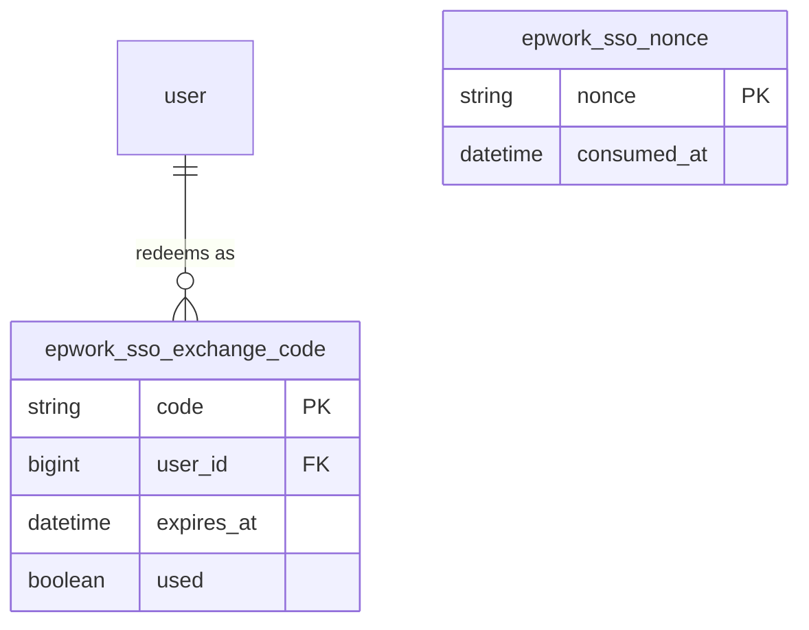

# Data Model: epWorkApp SSO（008-yipu-sso）

## 1. 既有实体：`user`

与 `com.eplugger.domain.entity.User` / `V2__create_user_table` 对齐。

| 逻辑字段 | DB 列 | SSO 映射说明 |
|----------|--------|----------------|
| 圈内用户 ID | `id` | JWT `subject`，不变 |
| 外部 SSO 标识 | `sso_id` | epWorkApp payload **`uid`**（必填） |
| 手机号 | `phone` | payload **`mobile`**；若为空则占位串（见 research） |
| 姓名 | `name` | **`displayName`** |
| 头像 | `avatar` | **`avatarUrl`**（可空） |
| 部门 | `department` | 首版可留空；若对方后续扩展部门字段再映射 |
| 岗位 | `position` | **`role`** |
| 密码 | `password_hash` | SSO 自动开户为 **NULL** |

**Upsert 规则（建议）**:

1. `findBySsoId(uid)` → 若存在：更新 `name`、`avatar`、`position`、`phone`（若本次 mobile 非空则更新）。
2. 若不存在：新建用户，`sso_id = uid`，其余字段按上表填充，`password_hash = null`。

**校验**: 验签阶段已保证 payload 含所需 key；空字符串按「无值」处理。

## 2. 新表：`epwork_sso_nonce`

记录已消费的 **nonce**，防止重放。

| 列 | 类型 | 约束 | 说明 |
|----|------|------|------|
| `nonce` | VARCHAR(128) | PRIMARY KEY | 来自 token payload |
| `consumed_at` | DATETIME(6) | NOT NULL | 消费时间 |

**规则**: 验签成功且未过期后，**先** `INSERT`；若违反唯一约束则返回错误「已使用」。可选：定时任务删除 `consumed_at` 早于 N 天的行（N ≥ 对方 token 最大寿命若干倍即可）。

## 3. 新表：`epwork_sso_exchange_code`

短时交换码，用于前端换取圈内 JWT。

| 列 | 类型 | 约束 | 说明 |
|----|------|------|------|
| `code` | VARCHAR(64) | PRIMARY KEY | 随机不透明字符串 |
| `user_id` | BIGINT | NOT NULL, FK → user.id | 已映射用户 |
| `created_at` | DATETIME(6) | NOT NULL | 创建时间 |
| `expires_at` | DATETIME(6) | NOT NULL | 建议 60–120 s |
| `used` | TINYINT(1) | NOT NULL DEFAULT 0 | 一次性消费 |

**规则**:

- 创建：`/sso/login` 成功后在同一事务或紧随 nonce 插入后插入一行，`used=0`。
- 兑换：`POST /api/auth/sso/exchange` 在事务内 `SELECT ... FOR UPDATE` 或原子 `UPDATE ... WHERE used=0`，成功后标记 `used=1` 并返回 `LoginResponse`。

## 4. 关系简图

## 5. 状态与迁移

- Flyway 版本号：在现有 `V28` 之后递增（实现时以仓库下一可用号为准）。
- JPA：可用 `@Entity` 或纯 JDBC；为保持与项目一致推荐 **Repository + Entity** 或 **JdbcTemplate**（与团队习惯一致即可）。
